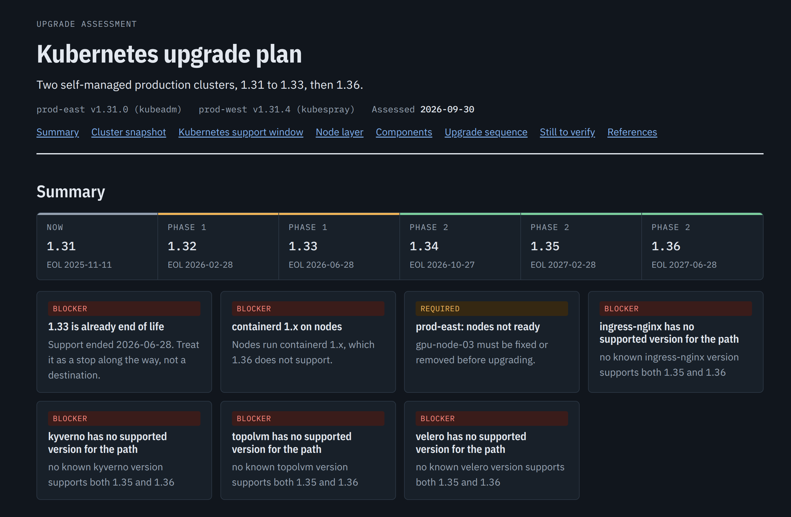
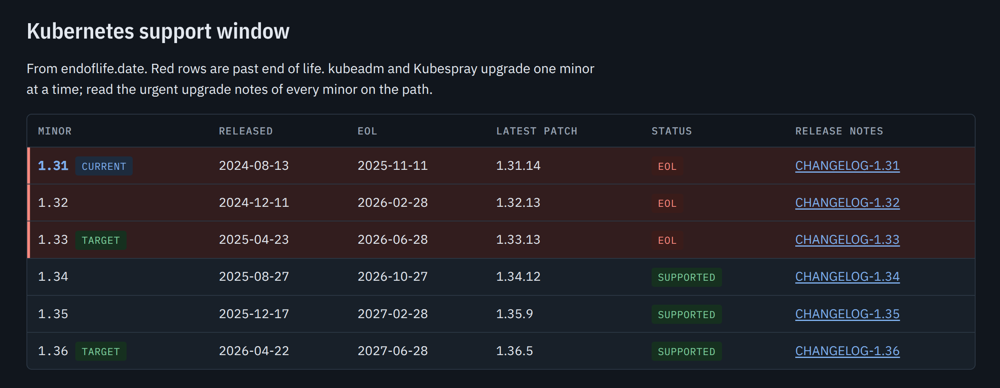
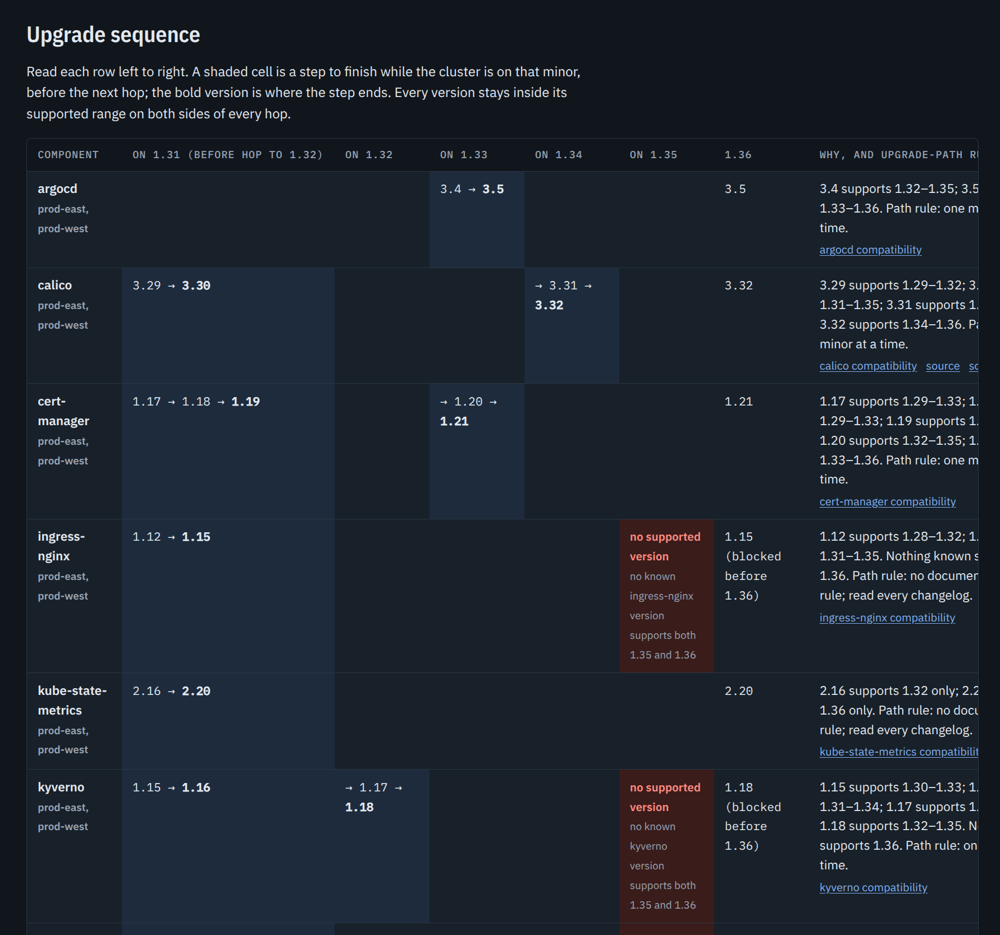

# Kubernetes Upgrade Planner

An agent skill that turns "we need to get from 1.31 to 1.36" into a plan you can
act on. It works in **Claude Code**, **Codex** and **OpenCode**.

Point it at your clusters and GitOps repos, and it tells you:

- how each cluster was installed (kubeadm, Kubespray, managed)
- which components block which hop, and which versions are already end of life
- the **bridge version** each component needs at each hop, in upgrade order
- what to fix on the nodes first: containerd, cgroup v2, kube-proxy mode, etcd

The result is a `report.md` and a `report.html` where every version has a
source. In Claude Code, the HTML is also shared as a private link.

The skill only reads. It never changes a cluster; upgrade commands go in the
report for a human to run.

## Install

```bash
git clone https://github.com/mhbahmani/Kubernetes-Upgrade-Planner.git
cd Kubernetes-Upgrade-Planner
./install.sh            # every agent on your PATH, global
```

To install for one agent or one project, use `--agent codex` or `--project DIR`.
You can also install with `npx skills` or through the Claude and Codex plugin
marketplaces; see [docs/install.md](docs/install.md).

The skill needs `kubectl`, `python3` with PyYAML, `jq` and `curl`.

## Use

Ask your agent:

> Plan the upgrade of prod-a and prod-b from 1.31 to 1.33, then 1.36.
> Scan ~/src/gitops and ~/src/mesh.

The report has these sections:

- **Summary**: the blockers
- **Cluster snapshot**: how each cluster is installed and what it runs
- **Support window**: end-of-life dates, with links to each changelog
- **Node layer**: runtime, cgroup, kube-proxy, etcd, API removals
- **Components**: current and target versions
- **Upgrade sequence**: a per-hop table showing the version each component must reach before each hop

## Example: a two-phase upgrade

These screenshots come from a real run on two self-managed production
clusters: one installed with kubeadm, the other with Kubespray. The cluster
names are anonymized. The first phase goes from 1.31 to 1.33, and the second from 1.33 to
1.36.

**The summary.** The upgrade path shows each hop, which phase it belongs to and
when that minor goes end of life. Under it, the blockers come first: 1.33 is
already end of life, nodes still run containerd 1.x, and four components have
no release that supports 1.36.



**The support window.** Each minor on the path has its release date, end-of-life
date, latest patch and changelog. Red rows are past end of life, so you can see
that the first phase ends on a release that is no longer supported.



**The upgrade sequence.** Read each row left to right. A shaded cell is a step
to finish while the cluster is on that minor, before the next hop, and the bold
version is where that step ends. For example, cert-manager moves 1.17 → 1.18 →
1.19 on 1.31, because 1.20 needs 1.32 or newer. It then goes to 1.21 on 1.33.
A red cell means no known version supports the next hop. The last column says
why, with links to each project's compatibility table.



## More

- [docs/install.md](docs/install.md): every install method, requirements, where the files go
- [docs/manual-run.md](docs/manual-run.md): run the scripts yourself, data sources, safety
- [docs/development.md](docs/development.md): tests, evals, repo layout

MIT licensed.
